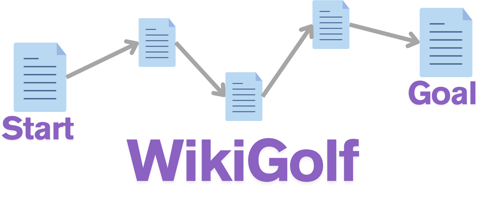

# WikiGolf




## 概要

あるWikipediaページから別のページへの経路を見つける。

このプログラムは[Word2Vec](https://radimrehurek.com/gensim/models/word2vec.html)モデルを利用して、各ページのリンクの中からゴールページと意味的に最も関連性の高いリンクを優先的にたどる。


## 特徴

- 日本語のWikipediaのみに対応 (This program is only designed for Japanese Wikipedia)。
- Word2Vecモデルを用いたコサイン類似度に基づいた経路探索
  - コサイン類似度が高い順番にn個のページを展開し，幅優先探索を行う。

## セットアップ

1.  **リポジトリのクローン**
    ```bash
    git clone https://github.com/Haru26g/WikiGolf.git
    ```

2.  **必要なPythonライブラリのインストール**
    ```bash
    pip install -r requirements.txt
    ```

3. **Word2Vecモデルのダウンロード**

    [WikiEntVec](https://github.com/singletongue/WikiEntVec)からモデルをダウンロードし、プロジェクトディレクトリに配置します。

4.  **(必要があれば)スクリプト内のWord2Vecモデルパスの編集**

    `WikiGolf_ja.py` の中の、`model_path` の値をWord2Vecモデルのパスに書き換える。

    ```python
    # WikiGolf_ja.py の main() 関数内
    model_path = 'jawiki.all_vectors.100d.txt'
    ```

## 実行

1.  ターミナルでスクリプトを実行する。
    ```bash
    python WikiGolf_ja.py
    ```

2.  Wikipedia APIのユーザーエージェントとして使用するメールアドレスを入力する。  
    これは、Wikipedia APIの利用規約に従うために必要です。

3.  「Startページ」と「Goalページ」のタイトルをそれぞれ入力します。

### 実行例
```
ユーザーエージェント用のメールアドレスを入力してください: your.email@example.com
モデルを読み込んでいます... (これには数分かかる場合があります)
モデルの読み込みが完了しました。

Startページを入力してください (終了するにはEnterキーのみ): 量子力学
Goalページを入力してください: イヌ

探索開始: 量子力学 -> イヌ
探索中 (深さ 1): 量子力学
探索中 (深さ 2): 生物
探索中 (深さ 2): 相補性
探索中 (深さ 2): 宇宙
探索中 (深さ 2): 局所性
探索中 (深さ 2): 量子もつれ
探索中 (深さ 2): 黒点
探索中 (深さ 2): 確率
探索中 (深さ 2): 科学
探索中 (深さ 2): 電磁波
探索中 (深さ 2): 分子
探索中 (深さ 3): 動物
ゴールに到達しました！ ステップ数: 3

--- 発見した経路 ---
量子力学 → 生物 → 動物 → イヌ
--------------------
```

## ライセンス

このリポジトリに含まれるソースコード (`.py` ファイル) は、MIT License の下で配布されています。

本プロジェクトで利用する学習済みWord2Vecモデルは、[WikiEntVec](https://github.com/singletongue/WikiEntVec)で公開されたものを使用しています。

配布元のライセンスに従い、この学習済みベクトル（モデル）は **Creative Commons Attribution-ShareAlike 3.0** の下で配布されています。
